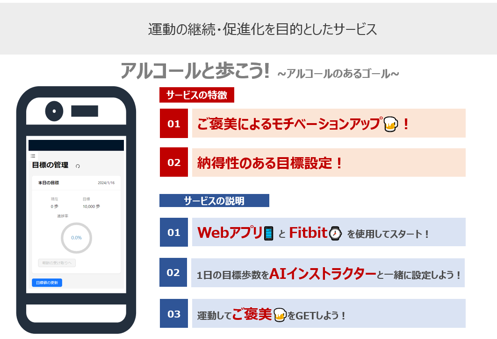
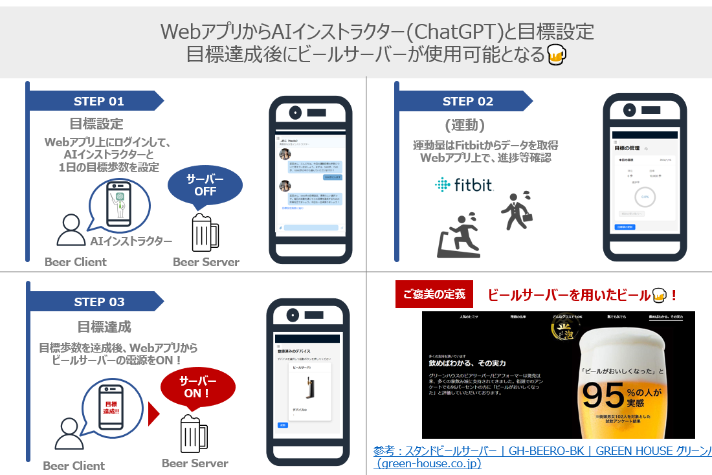
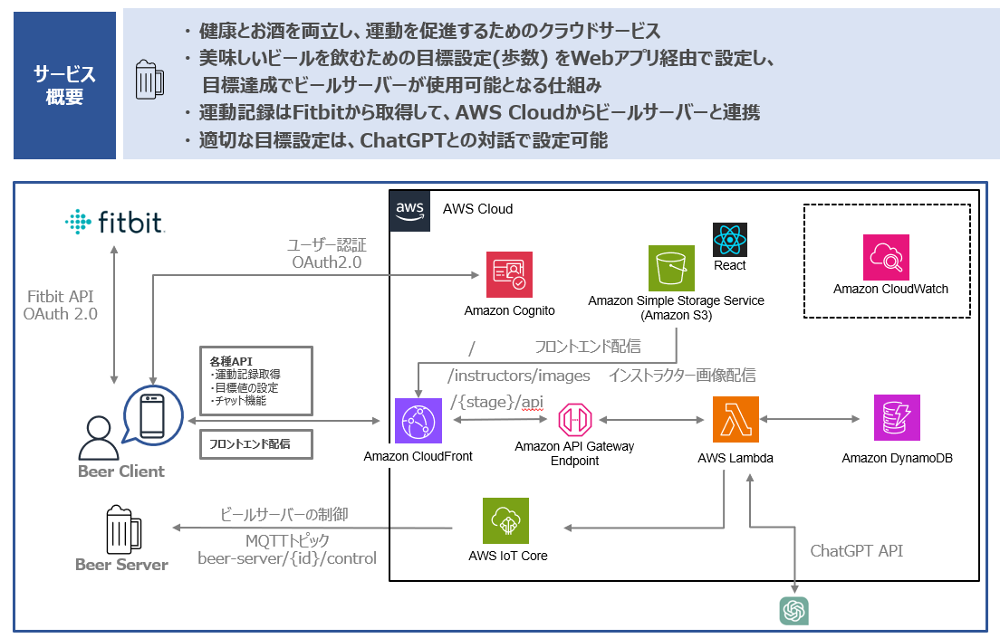

# d_practical_task
### アルコールと歩こう～アルコールのあるゴール～
2023年度iotクラウド技術応用塾　dチーム演習課題のリポジトリです。
# 主な使用技術・言語・フレームワーク一覧
### バックエンド
 
       

### フロントエンド
   

### ハード
 

### 外部連携

  


# サービス概要



## システム構成図


## フォルダ構成
```
.
├── .github
│   └── workflows #github actionsのワークフローを定義
|
├── beer-backend
│   ├── cloudformation #AWS リソースの内、samで定義していないリソースを定義
│   └── sam #Lambda, APIgatewayを定義
|       ├──layer #lambdaで用いるlayerを定義する用のフォルダ（一つのlayerに対して一つのフォルダを用意）
|       └──src #lambdaのコードを定義する用のフォルダ（一つのfunctionに対して一つのフォルダを用意）
|
├── beer-frontend
│   ├── public # index.htmlやfavicon.icoなどのreactに依存しないファイル
|   └── src # reactのコードはここに整理されている
|
└── beer-hard
    # ビールサーバー側のマイコンに組み込むコードはここにまとまっている
```

# 開発のための準備

## Fitbitへのアプリケーション登録
トラッカーなどを用いて計測したデータはFitbitのAPIから取得する必要があり、そのためにはFitbit の開発者ページから、[こちら](https://dev.fitbit.com/build/reference/web-api/developer-guide/getting-started/)を参考に「Register app」を行う必要があります。
「Redirect URL」には「https://{xxxxxxxxxxxxx}.cloudfront.net/redirect/login/fitbit」を設定してください(xxxxxxxxxx)は各環境のcloudfrontのIDを入れてください。


## Github リポジトリに必要な環境変数
CICDをGithub Actionsで実現しています。秘密情報であるクレデンシャルを情報をコード内に記載することは適切ではなく、Githubの秘密情報を扱うための仕組みである Github Secretsを用いてCICD時の秘密情報を扱うようにしています。[こちら](https://docs.github.com/ja/actions/security-guides/using-secrets-in-github-actions)を参考に必要な変数を定義してください。定義が必要な変数は以下です。
| シークレット名 | 値の取得方法|
| ---- | ---- |
| AWS_ACCOUNT_ID | OIDCを使用した認証を想定しています。[こちら](https://docs.github.com/ja/actions/deployment/security-hardening-your-deployments/configuring-openid-connect-in-amazon-web-services)を参考に、Roleを作成してください。そののち、アカウントのIDを指定することで認証が可能となります。 |
| FITBIT_AUTH_CLIENT_SECRET | Fitbitのクライアントシークレット値です。[こちら](https://dev.fitbit.com/build/reference/web-api/developer-guide/getting-started/)を参考に「Register app」を行い、登録したappのクライアントシークレットを入力してください |
| COGNITO_AUTH_CLIENT_SECRET  | Cognitoのクライアントシークレット値です。[こちら](https://docs.aws.amazon.com/ja_jp/cognito/latest/developerguide/user-pool-settings-client-apps.html)|

## フロント用CICDワークフローファイルの更新
シークレット以外の値を`/.github/workflows/ci-front.yml`および`/.github/workflows/cicd-front.yml`中で編集する必要があります。

## リンク
- [beer-backend/cloudformation](/beer-backend/cloudformation/README.md)
- [beer-backend/sam](/beer-backend/sam/README.md)
- [beer-frontend](/beer-frontend/README.md)
